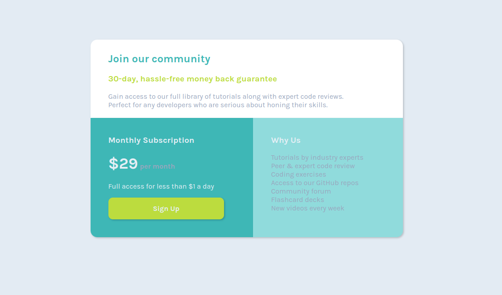

# Frontend Mentor - Single price grid component solution

This is a solution to the [Single price grid component challenge on Frontend Mentor](https://www.frontendmentor.io/challenges/single-price-grid-component-5ce41129d0ff452fec5abbbc). Frontend Mentor challenges help you improve your coding skills by building realistic projects.

## Table of contents

- [Overview](#overview)
  - [The challenge](#the-challenge)
  - [Screenshot](#screenshot)
  - [Links](#links)
- [My process](#my-process)
  - [Built with](#built-with)
  - [What I learned](#what-i-learned)
- [Author](#author)
- [Acknowledgment](#acknowledgments)

## Overview

### The challenge

Users should be able to:

- View the optimal layout for the component depending on their device's screen size
- See a hover state on desktop for the Sign Up call-to-action

### Screenshot

### Links

- Solution URL: [GitHub](https://github.com/MonarchRyuzaki/Single-Price-Card-Component)
- Live Site URL: [LivePage](https://monarchryuzaki.github.io/Single-Price-Card-Component/)

## My process

### Built with

- Semantic HTML5 markup
- CSS custom properties
- Flexbox

### What I learned

Did Not Really Learn Anything New. It was a good practice for flexbox and positioning things

### Continued development

I would like to continue improving upon positioning and flexbox

## Author

* LinkedIn - [Shivam Ganguly](https://www.linkedin.com/in/shivam-ganguly-357b90255/)
* Frontend Mentor - [@MonarchRyuzaki](https://www.frontendmentor.io/profile/MonarchRyuzaki)

## Acknowledgments

Special Thanks to [Colt Steele](https://www.udemy.com/user/coltsteele/) for his [Web Development Bootcamp](https://www.udemy.com/course/the-web-developer-bootcamp/).
